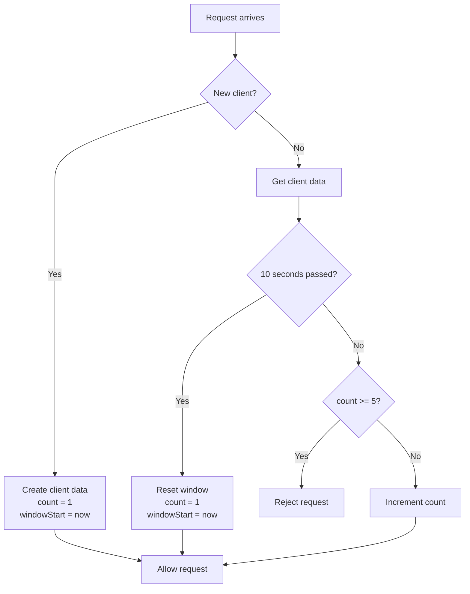

Rate Limiter 

1. fixed window 
A fixed window is a rate-limiting method where you divide time into fixed chunks and allow only a certain number of requests in each chunk.

For example:
Limit = 5 requests
Window = 10 seconds

Time       Request       Count

02s          #1            1
03s          #2            2
04s          #3            3
06s          #4            4
09s          #5            5
09s          #6           BLOCKED

at 10s the new window starts

## Fixed Window Rate Limiter

A fixed-window rate limiter allows a client to make a limited number of
requests within a fixed period of time.

**Example:** 5 requests every 10 seconds.



### Pseudocode

```text
LIMIT = 5
WINDOW = 10 seconds

clients = empty map

FUNCTION rateLimiter(client):

    currentTime = current time

    IF client does not exist:
        clients[client] = {
            count: 1,
            windowStart: currentTime
        }
        ALLOW request
        RETURN

    data = clients[client]

    IF currentTime - data.windowStart >= WINDOW:
        data.count = 1
        data.windowStart = currentTime
        ALLOW request
        RETURN

    IF data.count >= LIMIT:
        REJECT request
        RETURN

    data.count = data.count + 1

    ALLOW request
```

### Example

```text
Fixed Window = 10 seconds
Limit        = 5 requests

0s ───────────────────── 10s ───────────────────── 20s
│                         │                         │
│   Request 1 ✅          │   Counter resets        │
│   Request 2 ✅          │                         │
│   Request 3 ✅          │                         │
│   Request 4 ✅          │                         │
│   Request 5 ✅          │                         │
│   Request 6 ❌          │                         │
│                         │                         │
└────── Window 1 ─────────┴────── Window 2 ─────────┘
