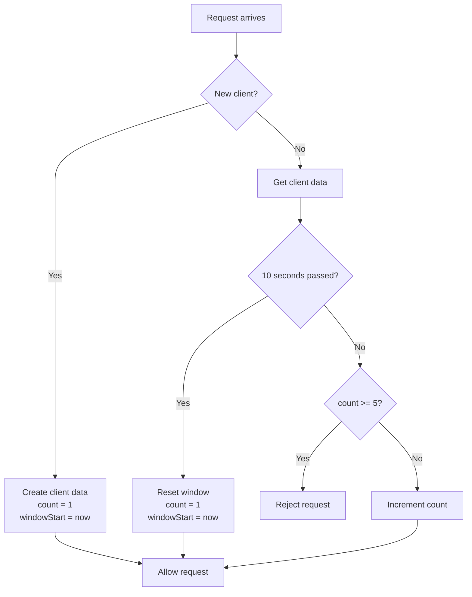
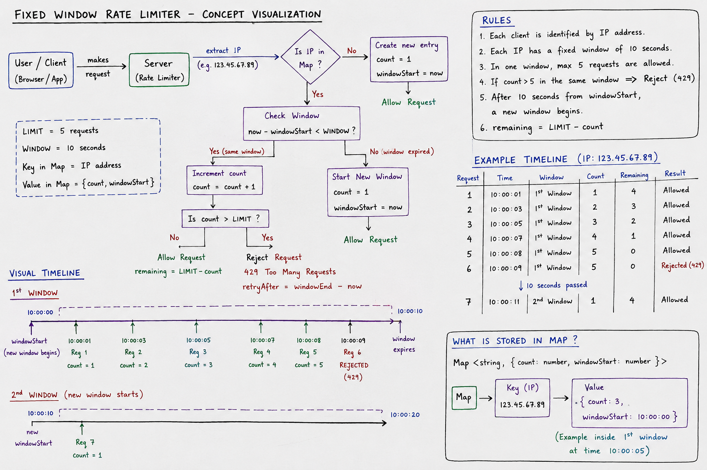

Rate Limiter
## Fixed Window Rate Limiter

A fixed-window rate limiter allows a client to make a limited number of
requests within a fixed period of time.

<h3>A fixed window is a rate-limiting method where you divide time into fixed chunks and allow only a certain number of requests in each chunk.

**Example:** 5 requests every 10 seconds.



### Pseudocode

```text
LIMIT = 5
WINDOW = 10 seconds

clients = empty map

FUNCTION rateLimiter(client):

    currentTime = current time

    IF client does not exist:
        clients[client] = {
            count: 1,
            windowStart: currentTime
        }
        ALLOW request
        RETURN

    data = clients[client]

    IF currentTime - data.windowStart >= WINDOW:
        data.count = 1
        data.windowStart = currentTime
        ALLOW request
        RETURN

    IF data.count >= LIMIT:
        REJECT request
        RETURN

    data.count = data.count + 1

    ALLOW request
```

### Example

```text
Fixed Window = 10 seconds
Limit        = 5 requests

0s ───────────────────── 10s ───────────────────── 20s
│                         │                         │
│   Request 1 ✅          │   Counter resets        │
│   Request 2 ✅          │                         │
│   Request 3 ✅          │                         │
│   Request 4 ✅          │                         │
│   Request 5 ✅          │                         │
│   Request 6 ❌          │                         │
│                         │                         │
└────── Window 1 ─────────┴────── Window 2 ─────────┘
```

### Key Notes

1. **What should the Map store for each client?**

So basically, the `Map` stores the count of how many times an IP address has hit the API. It keeps the current rate-limit information for each client.

2. **Why do we need windowStart?**
It is liek used to set or track when the client's current rate-limit window began.
it isn't necessarily "the time when the user starts calling the API" every single time. It's the start of the current 10-second window.


3. **When exactly should count be reset to 0?**
when thw window expires or time passed.
currentTime - windowstart >= WINDOW 
then We will reset the client's counter and start a new window.

4. **What should happen when count === LIMIT?**
obviously it will give limit exceed error that is 429 standard HTTP status.

5. **What should remaining mean?**
here it mean approximately like how many request the client can still make in the current window with a limit of x.

### Visualize the approach made with chatgpt

<p align="center">
  
</p>